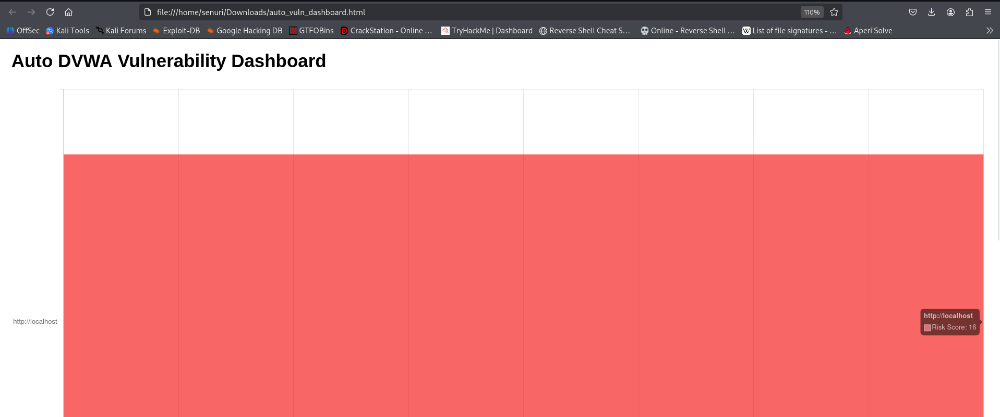

# DVWA Auto Vulnerability Scanner



## Overview
This project is an **automated vulnerability scanner** for DVWA (Damn Vulnerable Web Application). It detects common web vulnerabilities like **SQL Injection (SQLi), Cross-Site Scripting (XSS), and missing security headers**.  

It automatically crawls all pages in DVWA, logs in, refreshes the session if it expires, and generates an **interactive HTML dashboard** with:  
- Risk scoring per page  
- Collapsible tables for payloads and missing headers  
- Color-coded bar chart for easy visualization  
- Export filtered results as CSV  

---

## Features
- ✅ Automatic page crawling starting from the base URL  
- ✅ Auto-login and session refresh if the DVWA session expires  
- ✅ SQLi and XSS payload testing for forms  
- ✅ Security headers check (CSP, X-Frame-Options, X-Content-Type-Options, HSTS)  
- ✅ Interactive HTML dashboard with DataTables and Chart.js  
- ✅ CSV export of filtered results  

---

## Installation
1. Clone the repository:
```bash
git clone https://github.com/your-username/dvwa-auto-scanner.git
cd dvwa-auto-scanner
```
```bash
2.Create a Python virtual environment (optional but recommended):
```
python3 -m venv venv
source venv/bin/activate   # Linux/Mac
venv\Scripts\activate      # Windows

3.Install required packages:

pip install -r requirements.txt

Usage

Update configuration in dvwa_scanner.py:

BASE_URL = "http://localhost"
USERNAME = "admin"
PASSWORD = "password"

1.Run the scanner:

python3 dvwa_scanner.py

2.Open the generated dashboard:

auto_vuln_dashboard.html

Explore risk scores, SQLi/XSS payloads, and missing headers.

Export filtered results as CSV using the “Export Filtered CSV” button.


Create a Python virtual environment (optional but recommended):
